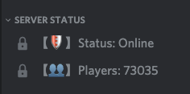
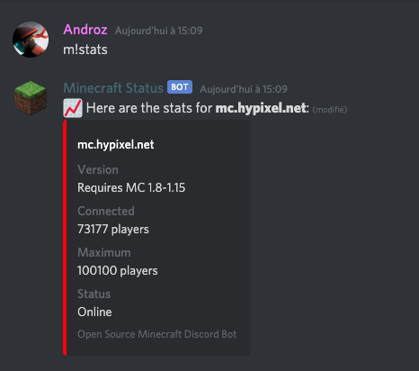

# Minecraft Discord Bot

Minecraft Discord Bot is a bot made for Minecraft servers that want to offer a great experience to users on their Discord. Indeed, users will see if your server is online, how many players are currently connected, all in real time!

## ✨ Features

* Players voice channel edited every 10 minutes that shows how many players are currently connected on your server.
* Status voice channel edited every 10 minutes that shows if your server is online.
* `!force-update` command to force the update of the voice channels.
* `!stats` command to show informations about your server (such as the server version, the maximum players, etc...)

#### Status Channels

Users will see at a glance if your server is online!

#### Stats Command

Users can also request more information using the `stats` command, for example to get the required Minecraft version.

## 🛠️ Installation

* **Clone** the repository (`git clone https://github.com/Androz2091/minecraft-discord-bot`) or **download** it.
* Install Node.js and NPM if they are not installed.
* Open your terminal and run `npm install` to install all the dependencies.
* [Fill the config file](#fill-the-config-file).
* Run `node .`
* You're done!
  
#### Fill the config file

You will have to fill the `config.json` file to make the bot working (rename the `config.sample.json` file to `config.json`). Here are some informations about the config file fields:

* `token` Your Discord bot token.
* `ipAddress`: The IP address of the server you want to track statistics. For example, can be `mc.hypixel.net` for Hypixel.
* `port`: The port of your minecraft server (optional, you can delete the field).
* `playersChannel`: The Discord ID of the voice channel that will show the number of players connected to your server.
* `statusChannel`: The Discord ID of the voice channel that will show the status of your server.
* `updateInterval`: The interval for the voice channel update. **Due to a recent update of Discord, the interval must be greater than 10 minutes**
* `prefix`: the prefix of the bot for text commands.
